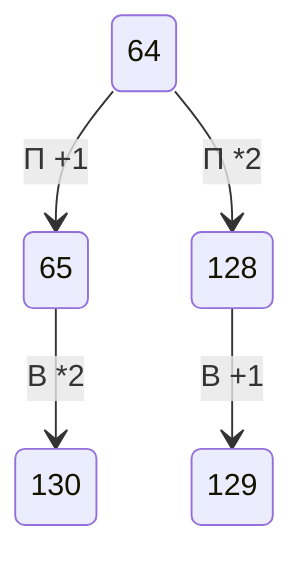
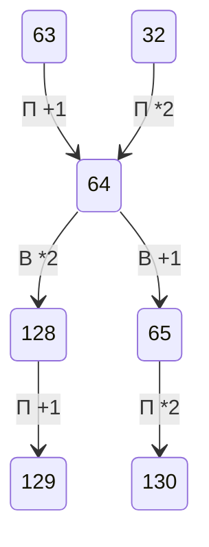
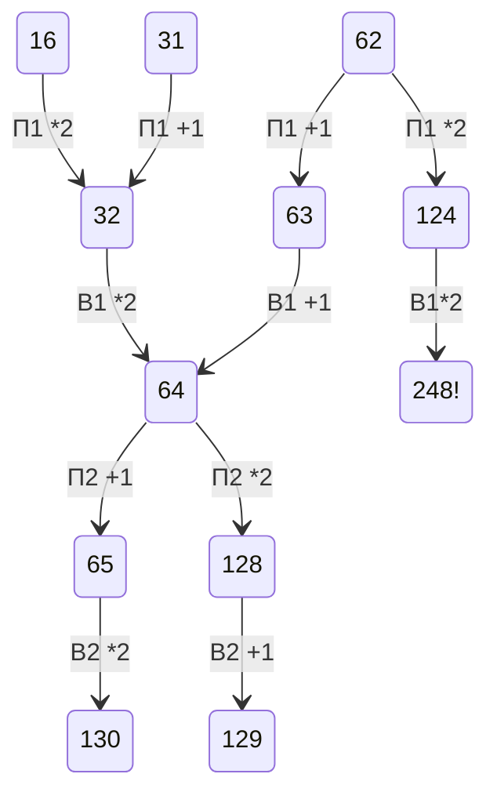

## 19

```mermaid
stateDiagram-v2

    64 --> 65:П +1
    64 --> 128:П *2
    65 --> 130:В *2
    128 --> 129:В +1
```

## 20

```mermaid
stateDiagram-v2

63-->64 :П +1
    32-->64 :П *2
    64-->128: В *2
    64-->65: В +1
    65 --> 130:П *2
    128 --> 129:П +1
```

## 21

```mermaid
stateDiagram-v2
62-->124 :П1 *2
62-->63 :П1 +1
16-->32 :П1 *2
31-->32 :П1 +1

124--> 248!:B1*2
32-->64 :В1 *2
63-->64 :В1 +1


64--> 65:П2 +1
64 --> 128:П2 *2

65 -->130 :В2 *2
128 -->129 :В2 +1

```
